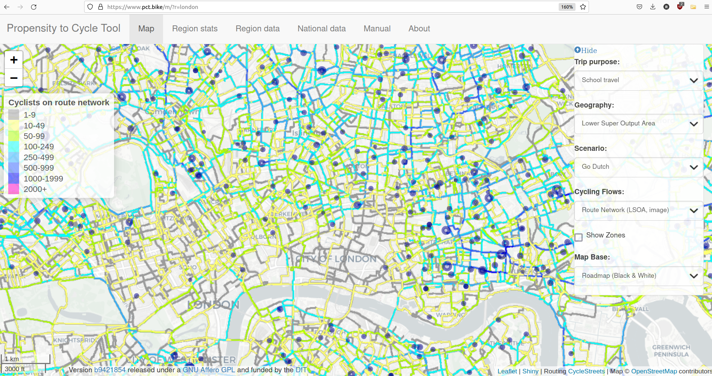
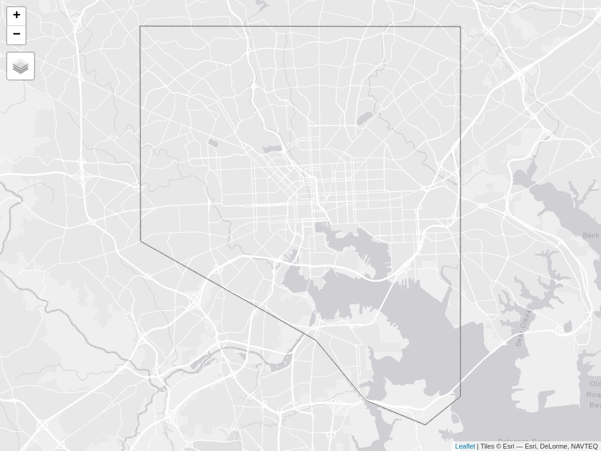
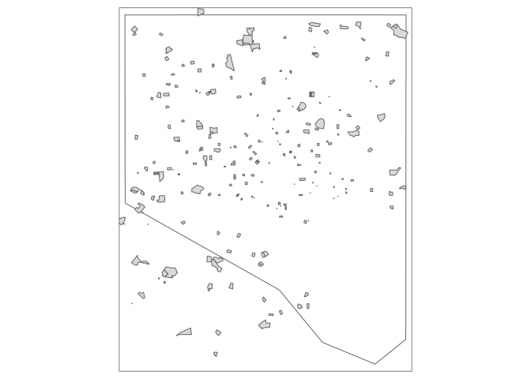
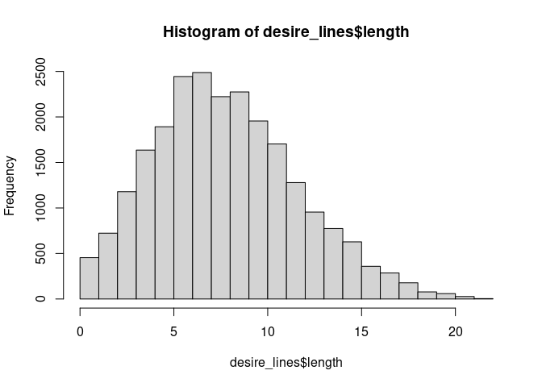
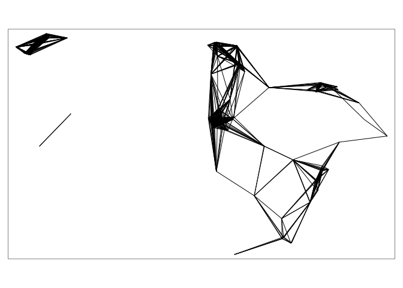

Estimating current and future potential levels of active travel to
school: a reproducible and internatially scalable approach based on open
source software (title TBC)
================

<!-- README.md is generated from README.Rmd. Please edit that file -->
<!-- badges: start -->
<!-- badges: end -->

# Abstract (TBC)

…

# Introduction

…

The goal of the paper is to create a basis for reproducible analysis of
open data to estimate current levels of, and estimates of future
potential for, active travel to schools, anywhere in the world, down to
the street level. The motivation is well documented: active travel is an
effective solution to environmental, health and social issues.
Specifically, there is a crisis of sedentary lifestyles affecting young
people worldwide. Building active travel into everyday life can mitigate
this crisis and lead to better mental health and educational outcomes,
and tackle inequalities that are exacerbated by the transport system.

By active travel we mean school pupils ‘moving on their own steam’ by
one of the following modes of transport:

- Walking
- Wheeling, which can include scooting, rollerblading, or even
  skateboarding
- Biking, using a pedal cycle
- Ebiking, using a pedal cycle with electric assist (aka pedelec)

There is a substantial body of research on active travel among young
people and ‘safe routes to school’ in particular. However, the relevance
of much of research for local transport planners tasked with
prioritising interventions in specific locations is limited because
results are rarely provided at the street level at which local
infrastructure decisions, such as improving sidewalks or creating new
protected cycles, are made.

One approach that does provide local results, and which is used by
transport planners in cities across England, is the Propensity to Cycle
Tool (PCT). First developed in 2015, the approach was extended in 2018
to estimate cycling potential to schools across England Goodman et al.
(2019). The results are publicly available nationwide via an interactive
web application hosted at [www.pct.bike](https://www.pct.bike/), as
shown in the image below for London, UK.



Problems associated with the ‘PCT approach’ represented in the image
above include:

- It is very focussed on data from one place, England, and is therefore
  not easily applicable to other countries or cities worldwide.

- It relies on origin-destination data *with estimates of mode split per
  OD pair,* something that is unfortunately not available in most
  places; mode of travel to school is rarely recorded and is seldom
  available at the OD level when it is.

- Furthermore, in many cases OD data representing travel to school is
  not available at all.

In many cases, especially in contexts where local or national
governments are undertaking research to support effective interventions,
OD datasets are available but these cannot be shared. This makes any
derived outputs subject to the same potentially strict licensing
agreements that apply to the OD data, preventing the data from being
used by a broad range of stakeholders including parents, head teachers,
advocacy groups and consultancies. Yet making the results of transport
models open is key to their impact Lovelace, Parkin, and Cohen (2020).

The good news is that more datasets are available than ever before that
can be used to inform sustainable transport policies, plans and
decision-making. OpenStreetMap data, which is contributed by the
community and free for non-commercial use worldwide, contains
information on most significant schools, roads, walkways and cycleways
in many cities. There are many other datasets that can be used to
support evidence-based transport planning in general and prioritisation
of safe routes to school in particular, including:

- Count datasets, for example cycle counters on roads that feed local
  schools

- Crash datasets, for example recording slight, serious and fatal
  injuries at high spatial and temporal resolution

- Socio-demographic data

However, the focus of this paper is on OSM data because it is so widely
available. It is hoped that work building on this foundation will
demonstrate how to incorporate other datasets into the analysis, for
example as the basis of research into inequalities in road safety
outcomes Vidal Tortosa et al. (2021).

# Data and Methods

<!--# The code below demonstrates the potential for reproducible research based on open source software to estimate travel to school patterns and walking, wheeling and cycling potential. -->

``` r
{
  library(tidyverse)
  library(tmap)
  library(stplanr)
  library(osmdata)
}
tmap_mode("view")
study_area_name = "Isle of Wight"
```

``` r
study_area = getbb(study_area_name, format_out = "sf_polygon", limit = 1)
```

``` r
tm_shape(study_area) +
  tm_borders()
```

    #> Interactive map saved to /home/robin/github/saturnlighting/safe2school/case-study-area.html

<!-- -->

``` r
schools_osmdata = opq(study_area_name) %>% 
  add_osm_feature(key = "amenity", value = "school") %>% 
  osmdata_sf()
schools_polygons = schools_osmdata$osm_polygons
tmap_mode("plot")
#> tmap mode set to plotting
m + qtm(schools_polygons)
```

<!-- -->

## Generate OD data

We need ‘origins’ as a basis for OD data. These can be zones,
residential buildings, or even nodes on the road network.

To demonstrate the approach with minimal data requirements, we can use a
random sampling strategy to generate points of origin as follows.

``` r
set.seed(2023)
origins = sf::st_sample(schools_polygons, size = 100)
#> Linking to GEOS 3.11.1, GDAL 3.6.2, PROJ 9.1.1; sf_use_s2() is TRUE
origins = sf::st_sf(data.frame(id = seq(length(origins))), geometry = origins)
```

Pupils tend to go to schools nearest to their homes. We will generate
desire lines associated with the points and the schools as follows,
removing desire lines longer than a threshold distance (10 km in this
case):

``` r
school_centroids = sf::st_centroid(schools_polygons) 
#> Warning: st_centroid assumes attributes are constant over geometries
desire_lines = od::points_to_odl(p = origins, pd = school_centroids)
desire_lines$length = as.numeric(sf::st_length(desire_lines)) / 1000
hist(desire_lines$length)
```

<!-- -->

``` r
desire_lines_short = desire_lines %>% 
  filter(length < 5)
qtm(desire_lines_short)
```

<!-- -->

``` r
nrow(desire_lines)
#> [1] 6300
nrow(desire_lines_short)
#> [1] 1061
```

## Spatial interaction model

..

``` r
library(simodels)
```

## Routing

…

## Uptake estimation

…

## Route network generation

# References

<div id="refs" class="references csl-bib-body hanging-indent">

<div id="ref-goodman_scenarios_2019" class="csl-entry">

Goodman, Anna, Ilan Fridman Rojas, James Woodcock, Rachel Aldred,
Nikolai Berkoff, Malcolm Morgan, Ali Abbas, and Robin Lovelace. 2019.
“Scenarios of Cycling to School in England, and Associated Health and
Carbon Impacts: Application of the ‘Propensity to Cycle Tool’.” *Journal
of Transport & Health* 12 (March): 263–78.
<https://doi.org/10.1016/j.jth.2019.01.008>.

</div>

<div id="ref-lovelace_open_2020" class="csl-entry">

Lovelace, Robin, John Parkin, and Tom Cohen. 2020. “Open Access
Transport Models: A Leverage Point in Sustainable Transport Planning.”
*Transport Policy* 97 (October): 47–54.
<https://doi.org/10.1016/j.tranpol.2020.06.015>.

</div>

<div id="ref-vidaltortosa_socioeconomic_2021" class="csl-entry">

Vidal Tortosa, Eugeni, Robin Lovelace, Eva Heinen, and Richard P. Mann.
2021. “Socioeconomic Inequalities in Cycling Safety: An Analysis of
Cycling Injury Risk by Residential Deprivation Level in England.”
*Journal of Transport & Health* 23 (December): 101291.
<https://doi.org/10.1016/j.jth.2021.101291>.

</div>

</div>
