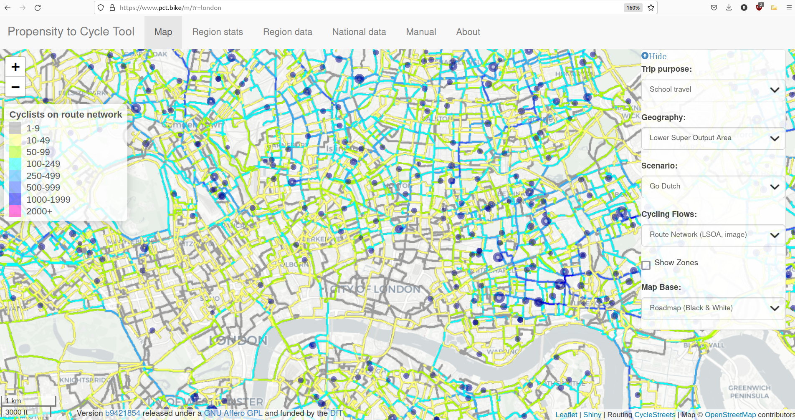

# Introduction


```{r, include = FALSE}
knitr::opts_chunk$set(
  collapse = TRUE,
  comment = "#>",
  echo = FALSE
)
```

This project proposal seeks to demonstrate the feasibility of computational methods to estimate current and future potential levels of active travel to schools down to the street level.
The motivation is well documented: active travel is an effective solution to environmental, health and social issues.
Specifically, there is a crisis of sedentary lifestyles affecting young people worldwide.
Building active travel into everyday life can mitigate this crisis and lead to better mental health and educational outcomes, and tackle inequalities that are exacerbated by the transport system.

Active travel means pupils 'moving on their own steam' by one of the following modes of transport:

-   Walking
-   Wheeling, which can include scooting, rollerblading, or even skateboarding
-   Biking, using a pedal cycle
-   Ebiking, using a pedal cycle with electric assist (aka pedelec)

There is a substantial body of research on active travel among young people and 'safe routes to school' in particular.
However, the relevance of much of research for local transport planners tasked with prioritising interventions in specific locations is limited because results are rarely provided at the street level at which local infrastructure decisions, such as improving sidewalks or creating new protected cycles, are made.

Propensity to Cycle Tool (PCT) approach, first developed for commute data in England and Wales, *can* provide results at the route network level.
The approach was extended in 2018 to estimate cycling potential to schools across England @goodman_scenarios_2019.
The results are publicly available nationwide via an interactive web application hosted at [www.pct.bike](https://www.pct.bike/), as shown in the image below for London, UK.



Problems associated with the original PCT approach represented in the image above include:

-   It is very focussed on data from one place, England, and is therefore not easily applicable to other countries or cities worldwide.

-   It relies on national origin-destination data *with estimates of mode split per OD pair,* something that is unfortunately not available in most places.

- The results have low geographic resolution, resulting in 'bitty' networks, not the type of dense networks found in countries with a high share of cycling for everyday trips.

- The results are focussed exclusively on cycling, ignoring walking, wheeling and e-biking.

This proposal sets out to explore cycling potential to a single school in Western Australia.
It can act as a pilot focussed on a single mode (cycling) in a single well-known area (to project collaborator) with a view to exploring future options for extending the approach to other schools and other active modes in the future.


# Data requirements

The minimum data requirements for this project are:

- School location and number and age range of pupils
- Data on the current transport system, for example, mode share of active modes for everyday trips in the surrounding area

With just these data inputs we could generate a rough estimate of active travel potential down to the route network level.
OSM data can be used for the transport network and residential areas which can be used to estimate flows to the school using a spatial interaction model.
However, the more data on the location, the better the results will be.
The following data inputs will improve the fidelity of the results:

- Postcodes or official zone codes of each pupil attending the school or (preferably) aggregate data with the number of students attending from each of the surrounding zones.
This OD data could have the following form:

```{r}
od_example = data.frame(
  zone_id = c("zone 01", "zone 02"),
  n_pupils = c(12, 28)
)
knitr::kable(od_example)
```

- Mode split of travel to school in total (e.g. 50% drive, 2% cycle, 48% walk) or for each OD pair if available.
- Catchment area of the school provided in a geographic file format such as Shapefile or GeoJSON
- Environmental data such as official data on cycle infrastructure and a digital elevation model (DEM) in the region
- Data on barriers to cycling in the area

In addition, local knowledge of the transport systems used to get kids to the school will be helpful in sanity checking the results.

# Planned outputs

The main output from the project will be route network data providing estimates of cycling potential down to the street level on roads and off-road cyclable routes to the school.
This network will be visualised interactively as the basis for prioritisation of investment to get more pupils and caregivers cycling to school.

We can also provide outputs that are available online with an interface similar to that created for the www.npt.scot project, and with statistics at area and segment levels, for example to help identify gaps in the network.

The pilot project will also provide detailed information on additional work that can be done, for example to find the benefits of different scenarios of cycling uptake and the potential for growth in other modes of active travel.
The pilot will provide insight into the potential for a regional project to estimate active travel potential (cycling, walking and cycling, or other active modes) to schools over a larger area.


# References

